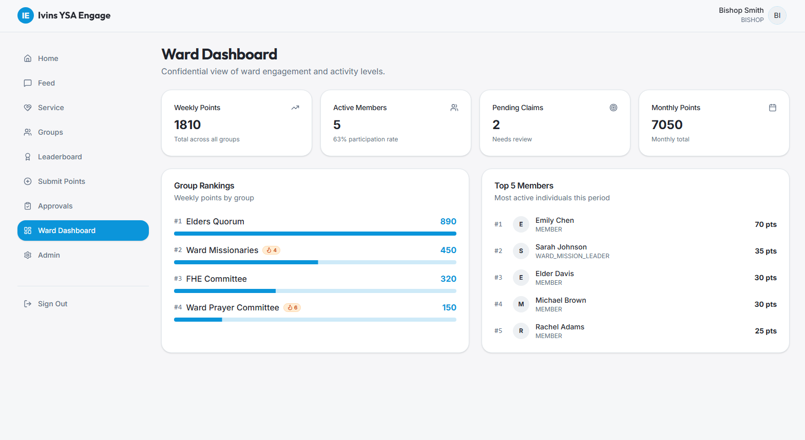
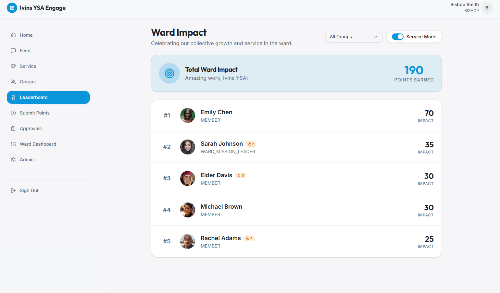
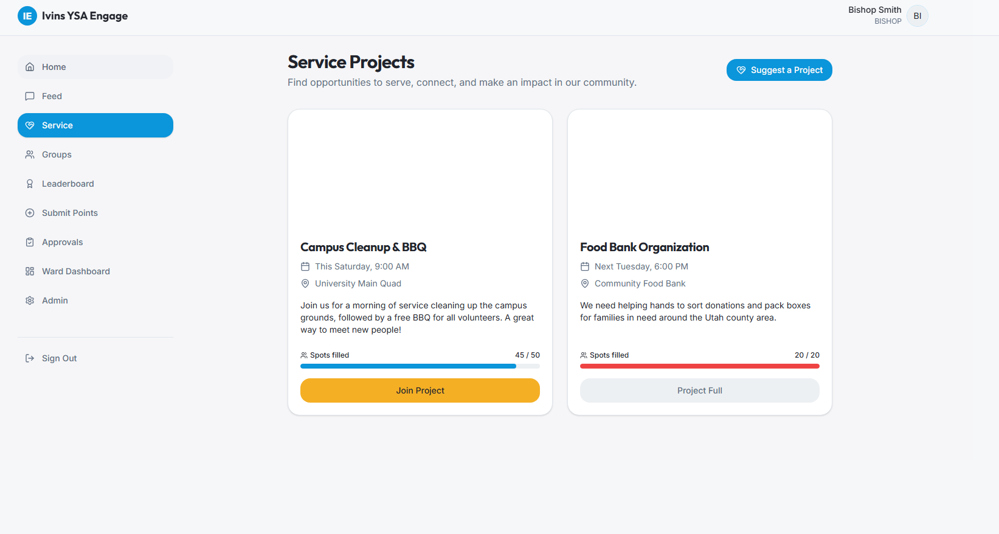

# 🏛️ Ivins YSA Engage - Community Gamification Platform

> **🔒 Closed Source Project Notice:** > *The source code for this application is hosted in a private repository to protect the privacy, data, and internal logic of the community it serves. This repository serves as a showcase of the UI/UX design, features, and technical architecture. Access to the source code for technical evaluation is available upon request during interviews.*

**Ivins YSA Engage** is a comprehensive Full-Stack web application designed to foster community engagement, gamify participation, and streamline organizational management for a university campus community in Utah.

---

## ✨ Key Features

### 1. Advanced Gamification & Leaderboards
Built a dynamic points system where members earn points for participation. The leaderboard relies on complex SQL aggregations (using Drizzle ORM) to calculate real-time scores, track participation streaks, and rank internal groups/wards.

### 2. Role-Based Access Control (RBAC)
Implemented a strict hierarchical permission system (Super Admin, Leaders, Members). Includes dedicated approval dashboards where leaders can review, approve, or reject "Activity Claims" submitted by members.

### 3. Interactive Social Feed
A centralized communication hub where members can share updates and leaders can "Pin" important announcements. Features real-time interactions (likes) handling concurrent database updates safely.

### 4. Event & Service Management
A module for organizing service projects with active concurrency control to manage capacity limits (e.g., capping event sign-ups at 50 people).

---

## 📸 Application Gallery

*(Caption: Administrative dashboard with real-time analytics and pending approvals)*

*(Caption: Real-time leaderboard with user streaks and group rankings)*

*(Caption: Service project management with capacity tracking)*

---

## 🛠️ Technical Architecture

### Backend (Node.js / Express)
* **Database:** PostgreSQL managed via **Drizzle ORM**. Extensive use of relational schemas, foreign keys, and complex aggregate queries (`SUM`, `COALESCE`, `GROUP BY`).
* **Security:** * Password hashing using `bcryptjs`.
  * Authentication via **JSON Web Tokens (JWT)** secured in `httpOnly` cookies to prevent XSS attacks.
  * Endpoint validation using **Zod** to ensure data integrity before DB execution.
* **File Management:** Avatar and image uploads handled securely via `multer`.
* **Design Pattern:** Implemented the Repository Pattern (`IStorage` interface) to decouple database logic from the Express routing layer.

### Frontend (React / Vite)
* **Styling:** Fully responsive UI built with **Tailwind CSS** and modern UI components (Shadcn/UI inspiration).
* **State Management:** Asynchronous data fetching and caching optimized for real-time updates (Feed & Leaderboard).
* **Tooling:** Vite for ultra-fast HMR and optimized production builds.

---
*Architected and developed by Daniel Alarcón.*
